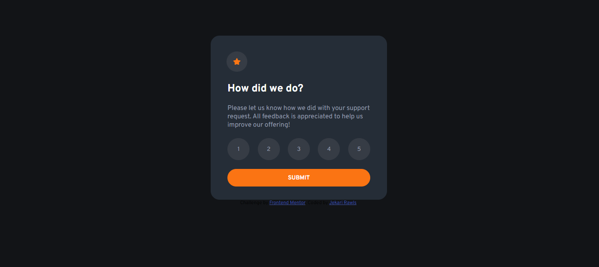

# Frontend Mentor - Interactive rating component solution

This is a solution to the [Interactive rating component challenge on Frontend Mentor](https://www.frontendmentor.io/challenges/interactive-rating-component-koxpeBUmI). Frontend Mentor challenges help you improve your coding skills by building realistic projects. 

## Table of contents

- [Overview](#overview)
  - [The challenge](#the-challenge)
  - [Screenshot](#screenshot)
  - [Links](#links)
- [My process](#my-process)
  - [Built with](#built-with)
  - [What I learned](#what-i-learned)
  - [Continued development](#continued-development)
- [Author](#author)
- [Acknowledgments](#acknowledgments)

**Note: Delete this note and update the table of contents based on what sections you keep.**

## Overview

### The challenge

Users should be able to:

- View the optimal layout for the app depending on their device's screen size
- See hover states for all interactive elements on the page
- Select and submit a number rating
- See the "Thank you" card state after submitting a rating

### Screenshot




### Links

- Solution URL: [Solution](https://www.frontendmentor.io/challenges/interactive-rating-component-koxpeBUmI/hub/responsive-interactive-rating-component-Q4kaE_Rs4a)
- Live Site URL: [Live Site](https://frontend-mentor-rating-component-solution.netlify.app/)

## My process

### Built with

- Semantic HTML5 markup
- CSS custom properties
- Flexbox
- JavaScript

### What I learned

I learned how to manage what I want to show on the screen by manipulating the DOM in JavaScript. When the button is clicked, I implement JavaScript code to change what the user sees.

```js
rating.addEventListener("click", event => {

    let input = document.getElementById("rating_input");
    input.innerHTML = event.target.innerHTML;

    submit.addEventListener("click", () => {
        rate_card.style.display = "none";
        thank_you.style.display = "block";
    })
})
```

### Continued development

I want to continue to use this method of maniplating the DOM for future projects.

## Author

- Website - [Jekari Rawls](https://jekarirawlsportfolio.netlify.app/)
- Frontend Mentor - [@Jekari99](https://www.frontendmentor.io/profile/Jekari99)

## Acknowledgments

I got inspiration from CodingGitHub's solution. His solution guided me with the JavaScript portion of the challenge.

